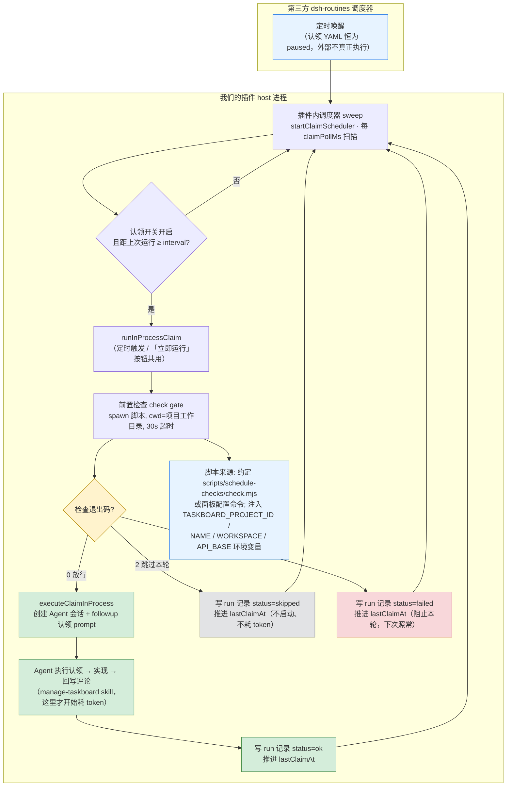

# 认领前置检查（claim check gate）设计方案

> 状态：方案已对齐，待实施。本文档记录"任务触发前先执行检查脚本"的完整设计，供实施时对照。

## 1. 目标

自动认领在真正启动 Agent（消耗 token）之前，先执行一个检查脚本：

- 退出码 `0`：放行本轮，正常认领执行。
- 退出码 `2`：跳过本轮——不启动 Agent、不消耗 token。
- 其他退出码 / 脚本报错 / 超时：阻止本轮，并记录失败结果。

收益：把"条件是否满足"这类判断从 Agent 决策中剥离，交给确定性、零 token 的脚本闸门。典型场景：仓库有未提交改动不认领新任务、CI 未跑完则跳过、磁盘/网络不满足则阻止。

## 2. 背景：触发链路与第三方边界

自动认领当前由 dsh-taskboard 插件自身在 host 进程内执行。第三方 dsh-routines 只做最外层定时唤醒，且认领 YAML 恒为 `paused: true`（见 `plugin/lib/claim-routines.mjs`），外部调度器实际不真正执行；"到点是否真的启动 Agent"的决策权一直在插件自己的代码里。因此前置检查完全插在插件自有代码中，**不需要改编任何第三方插件**。

触发入口有两个，汇聚于 `runInProcessClaim`（`plugin/lib/index.mjs`）：

1. 定时调度：`startClaimScheduler` 每 `claimPollMs`（默认 30s）扫描开启自动化的项目。
2. 「立即运行」按钮：对认领例程手动触发。

前置检查插入 `runInProcessClaim` 内、`executeClaimInProcess`（`plugin/lib/claim-executor.mjs`）之前，一个点覆盖全部触发方式。

> 心跳 runner（Reasonix heartbeat / `scripts/heartbeat-runner.mjs`）均为历史路径，本次不涉及。

## 3. 架构流程图



要点：

- **虚线边界**：第三方只在外层"叫醒"，`H1` 之后全部是插件自有代码，前置检查无需改编任何第三方插件。
- **check gate（黄）**：插在 `runInProcessClaim` 与创建 Agent 之间，定时 / 立即运行两个入口天然共用。
- **三分支**：`0` 放行（绿）才创建会话；`2` 跳过（灰）零 token；其他 / 超时 / 报错（红）阻止并留痕。
- **回环**：三种结果都回到调度器且都推进 `lastClaimAt`，避免每轮 30s 反复空转。

## 4. 退出码语义

| 结果 | 处置 | run 记录 status |
|---|---|---|
| 退出码 `0` | 放行本轮，正常认领 | `ok` |
| 退出码 `2` | 跳过本轮：不建会话、不耗 token | `skipped` |
| 其他退出码 | 阻止本轮 + 记录失败 | `failed` |
| spawn 失败（脚本不存在 / 无解释器） | 阻止本轮 + 记录失败 | `failed` |
| 超时（默认 30s，可配） | kill 进程树 + 阻止本轮 + 记录失败 | `failed` |

用 `2` 表示"主动跳过"是关键：它与"异常失败"处置不同——跳过是正常状态（照常等下一次调度），失败是异常状态（留痕、供面板可见）。

## 5. 两层 gate：内建统一检查 + 可选附加脚本

认领的检查分两层，语义不同（与外部 AI 工具的"每任务可配置前置检查"对应，但认领多一层底座）：

| 层 | 内容 | 配置性 | UI 表现 |
|---|---|---|---|
| ① **内建统一检查** | 查看板该项目是否有 `todo` 任务；没有 → 跳过本轮（零 token）；查询失败 → 阻止并记录 | **默认对全部认领项目生效**，无开关 | 不设开关（认领的本质；关了认领就没意义） |
| ② **可选附加脚本** | per-project `checkCommand`（或约定脚本），项目特定附加条件 | 可配置：开关 + 脚本命令 | 自动化设置弹窗：**前置检查开关 + 检查脚本输入框** |

两层串联：① 通过后执行 ②；② 未配置直接放行。外部工具"每个自动化任务选择要不要前置检查、脚本是什么"对应到这里是 ② 层的开关与脚本字段。

### 脚本来源（②层）

**约定路径 + 面板覆盖**，两层来源，都为空则不检查（完全向后兼容）：

1. 默认约定：`<项目工作目录>/scripts/schedule-checks/check.mjs`，存在即执行（随仓库版本控制、团队共享、零配置）。
2. 面板覆盖：自动化配置可选字段 `checkCommand`（存数据库 `projects.automation_check_command`，与 enabled / interval / model 并列），非空时替代默认约定路径。
3. 配置存**完整命令字符串**（如 `node check.mjs`），自带解释器——这是 Windows 显式解释器要求（`.mjs` 在 Windows 无可靠直接执行关联）的跨平台解法。

### 逻辑统一、参数注入（"不同项目任务数不同"的答案）

认领检查的判断逻辑对**所有项目相同**（"当前项目有没有 todo 任务"），差异只在参数（projectId 自动代入）与结果（有任务放行 / 空项目跳过），**不需要 per-project 差异化脚本**。若 ② 层用脚本表达附加条件，同一共享脚本可被多项目复用：插件注入 `TASKBOARD_PROJECT_ID` 等环境变量，脚本读取即知在为哪个项目检查。

## 6. 执行细节

- 执行方式：`child_process.spawn`，`cwd` = 项目工作目录（`project.workspacePath`）。
- 环境变量注入（供脚本做条件判断，可自行调看板 HTTP API）：
  - `TASKBOARD_PROJECT_ID`
  - `TASKBOARD_PROJECT_NAME`
  - `TASKBOARD_WORKSPACE`（项目工作目录）
  - `TASKBOARD_API_BASE`（本机回环 API 基址）
- 超时：默认 30s（可配），超时 kill 进程树，按失败处理。
- 退出码与 stdout/stderr 一并捕获，供记录使用。

## 7. 结果记录

复用现有 run 记录机制（`<工作目录>/.dsh/routines/runs/*.json`，dsh-routines schema），扩展：

- `status: 'ok' | 'skipped' | 'failed'`
- check 退出码、耗时、stdout/stderr 摘要（截断）
- 失败时附原因（超时 / spawn 失败 / 退出码）

`plugin.log` 同步留一行；自动化面板可见最近一次 check 结果（UI 后补，见 §9）。skip / 失败**不写看板任务评论**（本次范围外）。

## 8. 节流：避免空转

skip 与失败之后都必须推进 `lastClaimAt`（视为"本轮已处理"），否则 30s 一次的 sweep 会反复执行 check 甚至连续空转跳过。失败不打断下次调度：下次 check 通过即放行（脚本自愈），失败记录在 run 记录与日志中可见。

## 9. 阶段 1 实施路径（认领 check gate，最小闭环）

> 状态：**已实现并端到端验证**（2026-08-18）。改动文件：`plugin/lib/check-gate.mjs`（新增）、`plugin/lib/index.mjs`、`plugin/lib/claim-executor.mjs`、`server/database.mjs`、`server/app.mjs`（均已同步 `plugin/vendor/server/`）。

| 步骤 | 改动 |
|---|---|
| 1. 执行器 | 新增 `plugin/lib/check-gate.mjs`：命令解析、spawn（cwd + 环境变量）、超时 kill、退出码分类。**保持与调用方解耦**（输入 = 命令串 + cwd + 环境变量；输出 = 放行 / 跳过 / 失败），供阶段 2 复用 |
| 2. 插入点 | `plugin/lib/index.mjs` `runInProcessClaim`：调 check gate，非 0/2 提前返回并写 run 记录 |
| 3. 数据 | `server/database.mjs` 加列 `automation_check_command`（照抄现有迁移模式 `database.mjs:507-517`）；`server/app.mjs` automation API 允许该字段 |
| 4. run 记录 | `claim-executor.mjs` 支持 `skipped` / `failed` status 与 check 摘要字段 |
| 5. UI | 自动化面板（`ProjectAutomationMenu.tsx`）加"前置检查"开关 + 脚本输入框；`api.ts`/`App.tsx` 透传 `checkCommand`；已重建 vendored `dist/web` |

### 端到端验证记录（真实操作路径）

对 dsh-taskboard 项目（automation 开启 + `checkCommand` 指向测试脚本）实测：

| 脚本退出码 | 观测结果 | 会话 |
|---|---|---|
| 2（跳过） | run 记录 `status: skipped`，`exitCode: 2`，`error: "skipped by check gate (exit 2)"`，stdout 含注入的 `TASKBOARD_PROJECT_ID`/`TASKBOARD_WORKSPACE` | 未启动 ✓ |
| 1（失败） | run 记录 `status: failed`，`exitCode: 1`，`error: "blocked by check gate (exit 1)"` | 未启动 ✓ |
| 0（放行） | run 记录 `status: running` → `ok`（sessionId 存在，会话正常完成） | 启动 ✓ |

日志佐证（`~/.dsh/storages/dsh-taskboard/plugin.log`）：

```
[claim] <projectId>: check gate → skip (exit=2, 73ms)
[claim] <projectId>: check gate → fail (exit=1, 70ms)
[claim] <projectId>: check gate → pass (exit=0, 80ms)
[claim] <projectId>: kicked in-process session claim-xxx (dsh-taskboard)
```

**语义边界确认**：gate 为 per-project——配置了 `checkCommand`（或工作目录存在约定脚本）的项目才被检查；未配置的项目直接放行（向后兼容，行为与上线前一致）。验证后 dsh-taskboard 项目 automation 已恢复原状（关闭）。

## 9b. 阶段 2：周期任务迁移插件内置 + precheck（参考移植自研）

### 背景：为什么这些任务不在看板里

`req-stage-scan`、`yunxiao-*` 等外部扫描/同步/报告任务**是周期性重复执行的**（`req-stage-scan`：每天 9 点 cron；`yunxiao-new-req-scan`：`every 12h`；`yunxiao-req-auto-sync`：`every 6h`）。看板认领是**一次性任务模型**：todo 议题被认领 → in_progress → 回写 → in_review，做完即止。周期任务放进看板意味着每次执行完要再造新任务、或让任务在状态循环里打转——模型不匹配，因此它们保留在例程体系里。

### 决策：不 vendor、不依赖第三方，参考移植为插件自有调度

第三方 `@dsh-routines`（git+https://github.com/Jesse-njx/dsh-routines.git）经评估：

- **MIT 许可**，可自由复制/修改（保留版权头）；
- **全部实现仅 1767 行**（`cron.js / store.js / scheduler.js / run-record.js / state.js / run.js` 等）；
- 项目已有同类传统：`plugin/vendor/server/` 即 fork 自上游、自己维护、零 npm 依赖。

故采用**参考移植自研**：把核心调度逻辑移植为插件自有模块（`plugin/lib/routines/`），周期任务由插件内置执行，check gate 天然接入（与认领共用 `check-gate.mjs`）。

### 关键洞察：例程页展示不变

`/api/routines`（`server/app.mjs:1393`）本就由插件 server 读 `~/.dsh/routines/*.yaml` + run 记录做展示；第三方在展示层零参与。执行从第三方换到插件内置后，例程页列表/开关/最近运行状态**形态不变**，仅背后执行者变化。

### 移植兼容点（现有 YAML 已在用，必须支持）

| 兼容点 | 现状证据 |
|---|---|
| 双语法 schedule | `req-stage-scan` 用 `"0 9 * * *"`（5 字段 cron）；`yunxiao-*` 用 `"every 12h"` / `"every 6h"`（自然语言）——两种都必须支持 |
| run 记录位置与 schema | `<cwd>/.dsh/routines/runs/*.json`，dsh-routines schema，展示与统计零改动 |
| YAML 目录 | 继续读 `~/.dsh/routines/`（认领的虚拟 YAML 也在其中，一并保留） |
| 调度语义 | cron next-run 计算、`overlap: skip/queue/cancel-previous`、`timeoutMin`、时区 |

### precheck 接入

移植后的 scheduler 在写 running 记录**之前**执行 precheck（`precheck:` 可选 YAML 字段，命令串如 `node scripts/check.mjs`，不写 = 无检查，向后兼容）：

- `0` → 放行，继续启动执行；
- `2` → 写 run 记录 `status: skipped` + 推进 `lastRunAt`（不启动、零 token）；
- 其他 / 超时（默认 30s）→ 写 run 记录 `status: failed` + 推进 `lastRunAt`（阻止本轮，下次照常，脚本自愈）。

防空转：skip / 失败后必须推进 `lastRunAt`，否则每 30s 的 tick 会反复执行 precheck。

### 切换顺序（防双跑）

第三方 scheduler 每 30s tick，`paused: false` 的周期例程到点会真跑。迁移必须**先停第三方**（ops profile 摘掉 `@dsh-routines` 或全量置 paused），**再启动插件内置调度**，否则同一任务两套执行器双跑。

### 维护

- 上游 `Jesse-njx/dsh-routines` 公开可跟踪，升级靠定期 diff 合并；
- 认领虚拟 YAML 保留在 `~/.dsh/routines/`（插件内置调度使用），外部调度器不再存在后无需 paused 保护，但仍保留 paused 字段无害。

## 10. 已拍板决策

- 失败策略：本轮阻止，下次照常重试（脚本自愈），不冷却、不停用自动化。
- 范围：只覆盖自动认领（定时 + 立即运行），不做「在对话中打开」。
- 看板留痕：先只写 run 记录 + 日志，不动任务评论。
- 脚本来源：约定路径 + 面板覆盖（§5）。
- **周期任务不进看板**：一次性任务模型与周期重复执行不匹配；周期例程通过阶段 2 参考移植（自研调度 + precheck）获得同一闸门能力，不依赖第三方。
